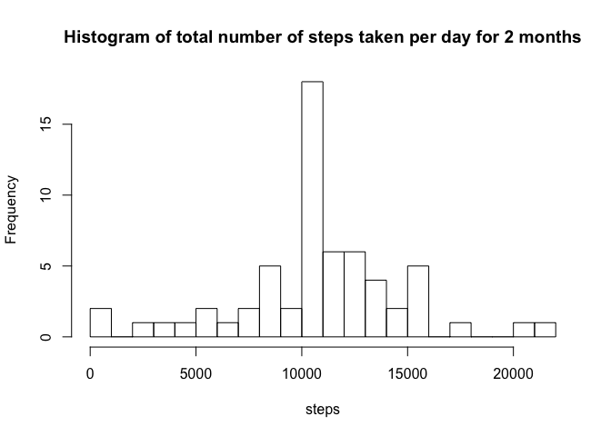

# activity.Rmd
Esteban Urdiales  

## loading and processing the data

```r
activity <- read.csv("activity.csv", colClasses = c("integer", "Date", "integer"))
```

## What is the mean total number of steps taken per day?

Here, tapply calculates the sum of the steps for every day. 

```r
dailySteps <- tapply(activity$steps, activity$date, sum, na.rm = TRUE)

hist(dailySteps, breaks = 30, xlab = "steps", 
     main = "Histogram of total number of steps taken per day for 2 months") 
```

<!-- -->

```r
median(dailySteps)
```

```
## [1] 10395
```

```r
mean(dailySteps)
```

```
## [1] 9354.23
```


## What is the average daily activity pattern?

```r
intervalStepMean <- tapply(activity$steps, activity$interval, mean, na.rm = TRUE)
plot(intervalStepMean, type = "l", col = "blue", xlab = "interval", 
     ylab = "Interval Step Mean", 
     main = "Average number of steps for each interval for 2 months")
```

<!-- -->

Calculate which 5 minute interval on average has the highest number daily of steps.
The first element in the array correpsonds to the actual time (in 5 minute intervals) 
and the second element is the interval number


```r
which.max(intervalStepMean)
```

```
## 835 
## 104
```

## Imputing missing values
Calculate the total number of missing values in the data set


```r
sum(is.na(activity$steps))
```

```
## [1] 2304
```

Create new data frame that will have missing data filled in


```r
activityNew <- activity
```

n is the number of days in October and November recorded


```r
n <- length(unique(activity$date))
missingValues <- ceiling(rep(intervalStepMean, n))
```

v is a vector of logicals of all the missing vales (NA)


```r
v <- is.na(activity$steps)
```

This command fills in the missing data by taking the ceiling of the mean for each interval over 
the two month period


```r
activityNew[v, "steps"] <- missingValues[v]

dailyStepsNew <- tapply(activityNew$steps, activityNew$date, sum)
hist(dailyStepsNew, breaks = 30, xlab = "steps", 
     main = "Histogram of total number of steps taken per day for 2 months")     
```

<!-- -->

Filling in the missing values increases the total number of daily steps.
It also smooths out the data as shown in the histogram

Calculate mean and median of new data


```r
median(dailyStepsNew)
```

```
## [1] 10909
```

```r
mean(dailyStepsNew)
```

```
## [1] 10784.92
```

## Are there differences in activity patterns between weekdays and weekends?

Create a new factor variable for a weekday or weekend


```r
activityNew$day <- "weekday"
weekend <- weekdays(activityNew$date) == "Saturday" | weekdays(activityNew$date) == "Sunday"
```

Now fill the day variable with the right string and make it a factor variable


```r
activityNew[weekend, "day"] <- "weekend" 
activityNew$day <- factor(activityNew$day)    
```

This takes the step data and returns the average steps over that 5 minute interval
for weekends and weekdays and returns a matrix which we then convert to a data frame.
The time series is then plotted. 


```r
intervalWeekdayMean <- tapply(activityNew$steps, 
                              list(activityNew$interval, activityNew$day), mean)
intervalWeekdayMean <- as.data.frame(intervalWeekdayMean)

interval <- unique(activityNew$interval)
intervalWeekdayMean <- cbind(interval, intervalWeekdayMean)

library(reshape)
df <- melt(intervalWeekdayMean, id.vars = "interval")

library(ggplot2)
g <- ggplot(df, aes(interval, value))
g + facet_wrap(~ variable, ncol = 1) + geom_line(color = "blue") +
    labs(x = "Interval", y = "Average number of steps")
```

<!-- -->
